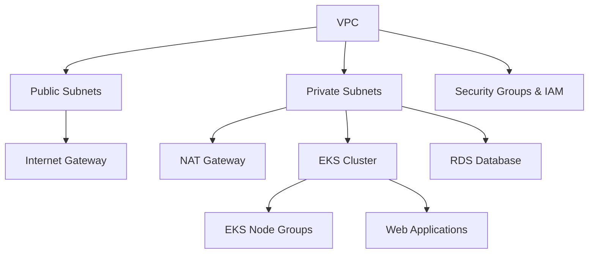
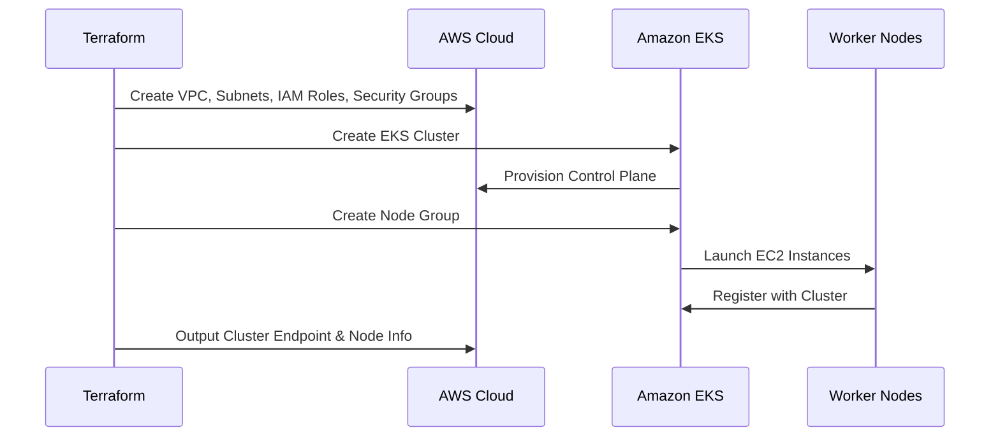

# Terraform AWS EKS Infrastructure

This repository provisions a **production-ready AWS infrastructure** using Terraform.  
It includes modules for **Networking, Security, Database, EKS Cluster, Node Groups, and Web Applications**.

---

## 📂 Project Structure

```
.
├── backend.tf.bkp
├── envs
│   ├── dev.tfvars
│   └── prod.tfvars
├── kubectl
├── main.tf
├── modules
│   ├── database
│   │   ├── main.tf
│   │   ├── outputs.tf
│   │   └── variables.tf
│   ├── eks
│   │   ├── cluster.tf
│   │   ├── iam.tf
│   │   ├── ng.tf
│   │   ├── outputs.tf
│   │   ├── sg.tf
│   │   └── variables.tf
│   ├── network
│   │   ├── iam.tf
│   │   ├── main.tf
│   │   ├── outputs.tf
│   │   └── variables.tf
│   ├── security
│   │   ├── main.tf
│   │   ├── outputs.tf
│   │   └── variables.tf
│   └── webapp
│       ├── main.tf
│       ├── outputs.tf
│       └── variables.tf
├── outputs.tf
├── providers.tf
├── variables.tf
└── versions.tf
```

---

## 📌 Features

- **VPC & Networking** – Creates VPC, Subnets, NAT Gateways, and Internet Gateway.  
- **EKS Cluster** – Provisions Amazon EKS cluster and node groups.  
- **IAM Roles** – Manages roles and policies for EKS and worker nodes.  
- **Security** – Security groups, NACLs, and best practices.  
- **Database** – Option to provision RDS or other DB backends.  
- **Web Application** – Deploys workloads into the EKS cluster.  

---

## 🚀 Getting Started

### 1️⃣ Prerequisites
- [Terraform](https://developer.hashicorp.com/terraform/downloads) >= 1.5  
- [AWS CLI](https://docs.aws.amazon.com/cli/) >= 2.0  
- [kubectl](https://kubernetes.io/docs/tasks/tools/)  
- Configure AWS credentials:  
  ```bash
  aws configure
  ```

---

### 2️⃣ Initialize Terraform
```bash
terraform init
```

---

### 3️⃣ Select Environment Variables
For **Dev**:
```bash
terraform apply -var-file=envs/dev.tfvars
```

For **Prod**:
```bash
terraform apply -var-file=envs/prod.tfvars
```

---

### 4️⃣ Connect to EKS
After creating the cluster, update kubeconfig:
```bash
aws eks --region ap-south-1 update-kubeconfig --name kt-dev-eks
```

Verify access:
```bash
kubectl get nodes
```

---

## 🏗️ Architecture



---

## 🔄 Provisioning Flow



---

## 📤 Outputs

After `terraform apply`, key outputs include:
- **EKS Cluster Name**
- **EKS Endpoint**
- **Node Group Name**
- **VPC ID**
- **Subnet IDs**

---

## 🔐 Security Best Practices
- Least privilege IAM roles for cluster and nodes.  
- Encrypted VPC Flow Logs sent to CloudWatch.  
- Security Groups locked down to required ports.  
- Optionally integrate with HashiCorp Vault for secret management.  

---

## 🛠 Example: Deploy a Sample App

```bash
kubectl create deployment nginx --image=nginx
kubectl expose deployment nginx --type=LoadBalancer --port=80
```

Check service:
```bash
kubectl get svc
```

---

## 📖 References
- [Terraform AWS Provider](https://registry.terraform.io/providers/hashicorp/aws/latest/docs)  
- [Amazon EKS Documentation](https://docs.aws.amazon.com/eks/)  
- [Terraform EKS Module](https://registry.terraform.io/modules/terraform-aws-modules/eks/aws/latest)  

---

## 👨‍💻 Author
Infrastructure developed and maintained by **DevOps Team**.
